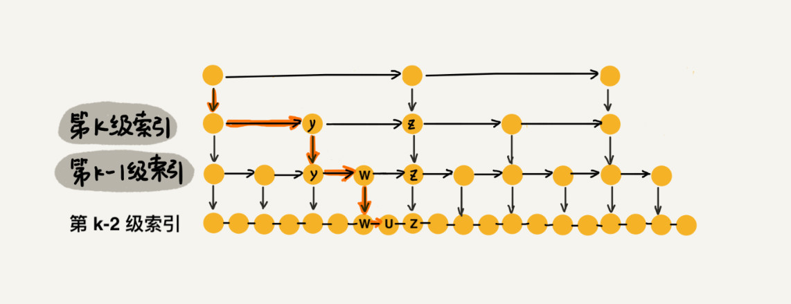
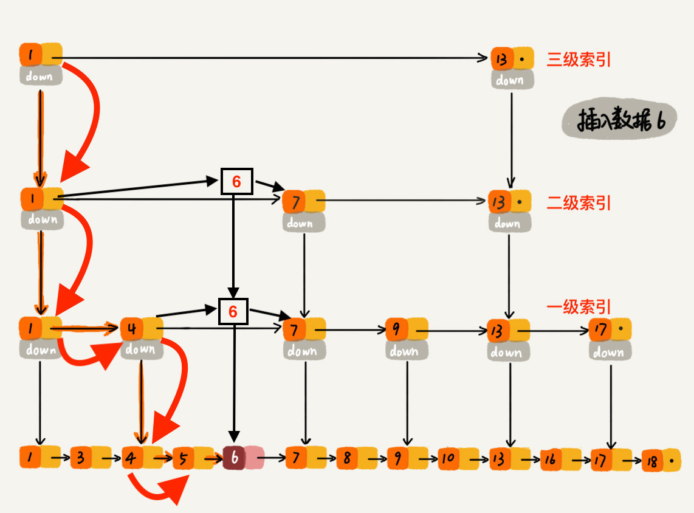
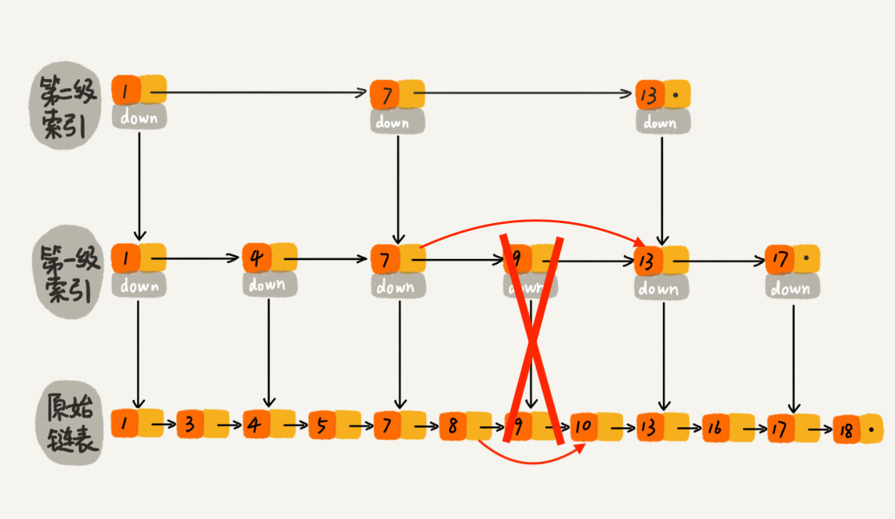

# structure/skiplist

### 什么是skiplist

- 在数组中，一组有序序列我们可以通过二分查找时间复杂度做到O(n)
- 但是数组显著的缺点是：
  - 数组一旦分配完毕，继续拓展的开销很大
  - 数组中每个元素所占空间必须相同
- 链表相比于数组，最大的优点就是灵活，但缺点是不能进行随机读取，查找效率低
- 跳表就是为了提升链表的查找效率，通过分层索引结构，把查找时间复杂度做到O(logn)

### 查找数据

### 插入数据

- 插入数据时，如果我们不改变索引，直接把数据插入原始链表，可能导致skiplist的索引不再均衡，可能导致退化为链表
- 显然，插入数据也需要对索引进行调整
- 调整策略如下：
    - 用一个函数randomLevel来计算每个元素的晋升层级，但要保证第一层1/2概率，第二层1/4，以此类推
    - 如果一个元素在level2，那么同时也要建立起level1
- 插入时间复杂度时O(logn)

### 删除数据

- 如果删除元素同时也是索引，需要一并把索引删除
- 删除时间复杂度是O(logn)

